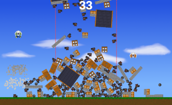
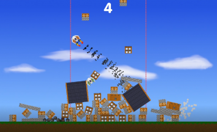

Home Havoc
==========
A two-player game where you play as two aliens who are fighting over the same resources. Only one rule: the one who builds the tallest house keeps the land and claims it as their home.

Example gameplay:

Running using binary
-------------------
1. Download the latest release binary from here https://github.com/giraffegrenade/home-havoc/releases
2. Extract and run HomeHavoc.exe (may need to disable windows defender as it is not signed)

Running using source
-------------------
1. Download the latest release source code from here https://github.com/giraffegrenade/home-havoc/releases
2. Extract code
3. Open Godot, and import project HomeHavoc
4. Run using Godot
